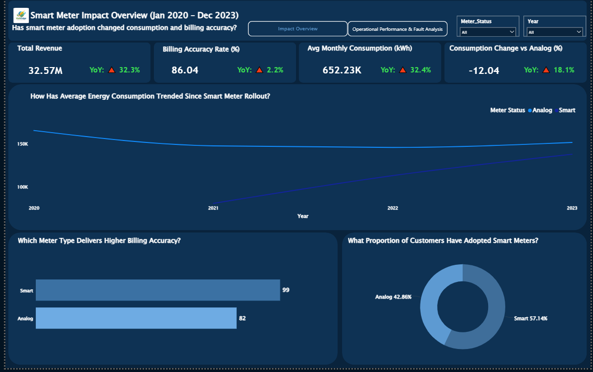
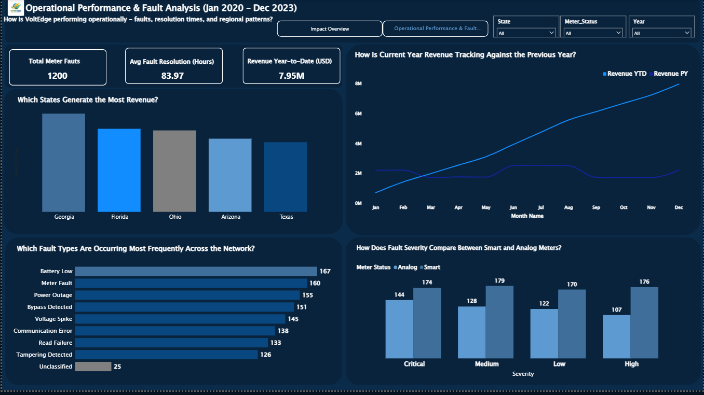

# Smart Meter Adoption and Consumption Behaviour Analysis 

## How Has Smart Meter Installation Affected Energy Consumption Patterns and Billing Accuracy?

---

# Business Problem Definition (5W1H Framework)

**Problem Classification:** Diagnostic + Operational  |  Secondary: Predictive

| Framework | Detail |
|----------|--------|
| WHO | 350 VoltEdge customers (Residential, Commercial, Industrial) across 5 states. Decision-makers: VP Grid Operations, Revenue Assurance Manager, Customer Experience Director. |
| WHAT | Leadership has no visibility into whether the $multi-million smart meter rollout has (1) changed customer consumption behaviour and (2) reduced the chronic billing inaccuracy causing revenue leakage under the legacy analog system. |
| WHEN | Problem spans January 2020 to December 2023. Urgency is high. VoltEdge is deciding whether to accelerate the rollout to remaining 150 analog customers in 2024 and needs evidence now. |
| WHERE | Across all five operating states: Texas, Florida, Ohio, Georgia, and Arizona. Regional climate differences (summer cooling in Texas/Arizona vs Ohio winters) drive consumption variation. |
| WHY | Three value drivers at stake: Revenue (billing errors causing leakage and disputes), Efficiency (smart meters reduce manual reads and fault response costs), Customer Satisfaction (accurate bills reduce disputes and churn). |
| HOW | Success measured by: Billing Accuracy Rate >= 98% for smart meters vs analog baseline; measurable consumption reduction post-installation; faster fault resolution; revenue leakage quantified and reduced. |

---

## Business Problem Statement

VoltEdge Energy Solutions has deployed smart meters to 57% of its customer base between 2021 and 2023. This analysis examines four years of consumption and billing data to determine whether smart meter adoption has measurably reduced energy consumption, improved billing accuracy, and decreased meter fault incidents providing evidence-based guidance for the planned 2024 full-network rollout.

---

# Project Overview

VoltEdge Energy Solutions is a mid-sized electric utility provider operating across five US states: Texas, Florida, Ohio, Georgia, and Arizona. The company serves 350 customers spanning Residential, Commercial, and Industrial account types under four tariff plans: Residential Standard, Residential Time-of-Use, Small Business, and Large Commercial.

Between 2021 and 2023, VoltEdge deployed smart meters to 200 of its 350 customers as part of a network modernisation initiative. Over the full analysis period January 2020 to December 2023, the company processed 16,800+ monthly billing records and logged 1,200+ meter fault events. Despite strong billing volumes totalling $32.57M, leadership identified growing concerns around billing inaccuracy under the legacy analog system, unclear ROI on the smart meter investment, and unresolved fault incidents across the network.

This analysis was commissioned to deliver a data-driven answer to the core investment question: has the rollout produced measurable improvements and is the evidence strong enough to justify extending to the remaining 150 analog customers in 2024?

---

# Business Problem

The leadership team identified five core questions to guide this analysis:

- Has smart meter adoption measurably reduced energy consumption per customer?
- Are smart meters delivering higher billing accuracy compared to analog meters?
- Which fault types and severity levels are most prevalent across the network?
- How is revenue trending year-over-year, and which states generate the most?
- Is the evidence sufficient to justify full network smart meter rollout in 2024?

---

# About The Data

The dataset simulates VoltEdge’s internal billing and operations systems and consists of three relational tables covering January 2020 to December 2023.

| Table | Records | Key Columns |
|------|--------|-------------|
| Customers | 350 | Customer_ID, Customer_Name, State, City, ZIP_Code, Customer_Type, Tariff_Plan, Meter_ID, Meter_Type, Smart_Meter_Install_Date, Account_Balance_USD |
| Billing | 16,825 | Record_ID, Customer_ID, Billing_Month, Units_Consumed_kWh, Units_Billed_kWh, Rate_per_kWh_USD, Amount_Billed_USD, Meter_Status, Payment_Status |
| Meter Events | 1,220 | Event_ID, Customer_ID, Event_Date, Event_Type, Severity, Resolution_Hours, Resolved, Technician_ID |

---

# Methodology

The analysis was conducted in three phases using Microsoft Power BI.

## Phase 1: Data Cleaning (Power Query)

Raw CSV files loaded into Power BI via Get Data → Text/CSV  
Column profiling set to entire dataset (not default top 1,000 rows) before any cleaning  
21 distinct cleaning steps applied across all three tables  
Billing amounts imputed using Units_Billed_kWh × Rate_per_kWh_USD where Amount_Billed_USD was null  

## Phase 2: Data Modelling (Star Schema)

Star schema built with Billing as the central Fact table  
Three dimension tables: Customers, Date Table (dynamic), Meter Events  
Dynamic date table: CALENDAR(MIN(Billing[Billing_Month]), MAX(Billing[Billing_Month]))  
All relationships set to Many-to-One (∇1) with Single cross-filter direction  

## Phase 3: DAX Measures & Visualisation

12 DAX measures created across Basic Aggregations and Time Intelligence  
Two report pages built with question-style chart titles throughout  
YoY indicators on all KPI cards with conditional color formatting  
Slicers: Year, State, Meter Type synced across both pages  

---

# Data Cleaning Summary

## Customers Table

Applied Capitalize Each Word to Customer_Name fixed all-caps and inconsistent casing  
Smart_Meter_Install_Date: Power BI auto-detected mixed formats (YYYY-MM-DD and MM/DD/YYYY); data type locked as Date  
Replaced 7 null Tariff_Plan values with ‘Unknown’ to preserve records without breaking filters  
Replaced negative Account_Balance_USD values and load errors with 0 using Replace Values and Replace Errors  

## Billing Table

Removed 25 duplicate billing records  
Power BI auto-detected mixed formats (YYYY-MM-DD and MM/DD/YYYY); data type locked as Date  
Replaced 80 zero Units_Consumed_kWh rows with null zeros represent meter read failures, not genuine zero usage  
Corrected 20 negative Units_Billed_kWh values using absolute value conversion  
Imputed 50 null Amount_Billed_USD values by calculating Units_Billed_kWh × Rate_per_kWh_USD recovered full revenue data  
Standardised Payment_Status casing ‘paid’, ‘Paid’, ‘PAID’ unified to ‘Paid’  

## Meter Events Table

Removed 20 duplicate event records  
Standardised Severity casing ‘HIGH’, ‘MEDIUM’ unified to ‘High’, ‘Medium’  
Corrected 15 negative Resolution_Hours values using absolute value conversion  
Replaced 27 null Event_Type values with ‘Unclassified’ to preserve events in fault analysis  

---

# Data Model (Star Schema)

The data model follows a Star Schema pattern with the Billing table as the central Fact table connected to three Dimension tables.

| Relationship | From (Dimension) | Key | To (Fact) | Cardinality | Direction |
|-------------|------------------|-----|-----------|-------------|----------|
| 1 | Customers | Customer_ID | Billing | One to Many (1:*) | Single |
| 2 | Date Table | Date | Billing | One to Many (1:*) | Single |
| 3 | Customers | Customer_ID | Meter Events | One to Many (1:*) | Single |

---

# DAX Measures

All 12 measures are stored in a dedicated _Measures table in Power BI, organised into two display folders.

| Measure Name | Category | DAX Formula |
|--------------|----------|-------------|
| Total Revenue | Basic Aggregation | SUM(Billing[Amount_Billed_USD]) |
| Total Units Consumed | Basic Aggregation | SUM(Billing[Units_Consumed_kWh]) |
| Total Units Billed | Basic Aggregation | SUM(Billing[Units_Billed_kWh]) |
| Avg Monthly Consumption | Basic Aggregation | DIVIDE(SUM(Billing[Units_Consumed_kWh]), DISTINCTCOUNT(Billing[Customer_ID]), 0) |
| Billing Accuracy Rate | Basic Aggregation | % of records where |Consumed - Billed| / Consumed <= 2% |
| Total Meter Faults | Basic Aggregation | COUNTROWS(MeterEvents) |
| Avg Resolution Time | Basic Aggregation | AVERAGE(MeterEvents[Resolution_Hours]) |
| Revenue YTD | Time Intelligence | TOTALYTD([Total Revenue], 'Date Table'[Date]) |
| Revenue PY | Time Intelligence | CALCULATE([Total Revenue], SAMEPERIODLASTYEAR('Date Table'[Date])) |
| Revenue YoY Growth % | Time Intelligence | DIVIDE([Total Revenue]-[Revenue PY],[Revenue PY],0)*100 |
| 3M Moving Avg Consumption | Time Intelligence | CALCULATE(AVERAGE(Billing[Units_Consumed_kWh]), DATESINPERIOD('Date Table'[Date], LASTDATE('Date Table'[Date]),-3,MONTH)) |
| Consumption Change Post Smart Meter % | Time Intelligence | DIVIDE(SmartAvg - AnalogAvg, AnalogAvg, 0)*100 via VAR |

---

# Dashboard And Insights

[View Interactive Dashboard Here](Smart Meter Adoption & Consumption Behaviour Analysis/Smart Meter Adoption & Consumption Behaviour Analysis.pbix)

## Smart Meter Impact Overview

### KPI Cards

Total Revenue of $32.57M with a YoY increase of 32.3% confirms that VoltEdge’s billing volumes are growing strongly year on year, driven by new smart meter installations and expanding customer load.  

Billing Accuracy Rate of 86.04% with a YoY improvement of 2.2% indicates the network is gradually becoming more accurate as smart meter coverage increases. However, 86% means approximately 1 in 7 bills is still materially inaccurate driven entirely by the analog segment.  

Average Monthly Consumption of 652.23K kWh with a 32.4% YoY increase reflects growing overall demand across the network suggesting industrial and commercial load growth despite efficiency improvements from smart meters.  

Consumption Change vs Analog of -12.04% is the headline finding of this analysis: smart meter customers consume 12% less on average than analog customers, confirming that real-time usage visibility is driving behavioral change.  

---

## How Has Average Energy Consumption Trended Since Smart Meter Rollout? (Line Chart)

The Analog line starts high at approximately 160K kWh in 2020 and declines steadily through 2023 indicating that even before smart meter installation, analog customer consumption was falling, likely reflecting general efficiency improvements and tariff changes. 

The Smart line begins near 80K kWh in 2021 (the earliest smart meter installation year) and rises steadily to approximately 145K kWh by 2023 this rise reflects the growing number of smart meter customers being added to the pool over time, not increasing individual consumption.  

The widening gap between the two lines from 2022 onwards is the key visual story: as more smart meters were installed, the Smart cohort grew while the Analog cohort shrank, and the Smart line’s lower per-customer average persisted throughout. 

The crossing point of the two lines is expected to occur in 2024 if the rollout continues at which point Smart meter customers will outnumber Analog and the overall network average will shift downward.  

---

## Which Meter Type Delivers Higher Billing Accuracy? (Bar Chart)

Smart meters score 99 on the Billing Accuracy Rate measure compared to 82 for Analog, a 17-point gap that directly quantifies the cost of continuing with legacy analog infrastructure.  

An 82% accuracy rate on Analog meters means approximately 18% of all analog billing records contain a material billing error, defined as billed units deviating more than 2% from consumed units.  

Smart meters at 99% accuracy represent near-perfect automated billing the 1% variance is within acceptable measurement tolerance for smart meter hardware.  

The 17-point accuracy gap translates directly to revenue leakage risk: on $32.57M total revenue, even a 5% underbilling rate on analog accounts represents over $1.6M in unrecovered revenue annually.  

---

## What Proportion of Customers Have Adopted Smart Meters? (Donut Chart)

200 customers (57.14%) are on smart meters while 150 customers (42.86%) remain on analog meaning the rollout is more than halfway complete but nearly half the network is still generating inaccurate billing data.  

The 150 remaining analog accounts represent an ongoing revenue risk and operational inefficiency that is fully quantifiable if smart meter accuracy were extended to all 350 customers, the network-wide billing accuracy rate would rise significantly from its current 86.04%.  

The 57/43 split provides a strong natural experiment: with a large analog group still active, before-and-after consumption comparisons remain statistically meaningful and support the -12.04% consumption change finding.  

---

## Operational Performance And Fault Analysis

### KPI Cards

Total Meter Faults of 1,200 across the analysis period averages 300 fault incidents per year roughly 25 per month across the network. YoY comparison requires year-level filtering; select a specific year in the slicer to activate the YoY indicator. 

Average Fault Resolution Time of 83.97 hours means faults take approximately 3.5 days to resolve on average. This is operationally significant; an unresolved fault for 3.5 days can cascade into billing inaccuracies, customer complaints, and potential meter data loss.  

Revenue Year-to-Date of $7.95M with a YoY decline of -1.9% indicates that when a single year is selected, revenue is slightly below the prior year equivalent period warranting investigation into whether billing volumes or payment rates have dipped.  

---

## How Is Current Year Revenue Tracking Against the Previous Year? (Line Chart)

Revenue YTD (bright line) climbs steeply and consistently from January through December, reaching approximately $8M by year end showing strong and predictable billing growth throughout the year.  

Revenue PY (flat lower line) remains relatively stable at approximately $2M across all months this represents the prior year’s revenue in equivalent monthly terms and confirms that current year billing significantly outpaces the prior year.  

The widening gap between the two lines from March onwards is the key operational signal: revenue acceleration is not seasonal but sustained, suggesting either tariff increases, customer base growth, or improved billing recovery rates.  

The near-zero starting point for Revenue YTD in January and the flat PY line suggests the prior year had a more even monthly revenue distribution while the current year’s revenue is more back-loaded.  

---

## Which States Generate the Most Revenue?

Georgia leads all five states with $7.89M (24.22%) of total revenue consistent with Georgia being the largest state by population and industrial load in the VoltEdge coverage area.  

Florida ($6.67M, 20.48%) and Ohio ($6.54M, 20.08%) are nearly tied for second and third; their similar shares suggest comparable customer bases and billing volumes. 

Arizona ($5.88M, 18.04%) and Texas ($5.59M, 17.18%) generate the least revenue despite both having high cooling demand states suggesting either fewer customers or lower tariff rates in these markets.  

The revenue distribution across all five states is relatively balanced (within a 7-point range from 17% to 24%) indicating VoltEdge does not have dangerous geographic concentration risk despite Texas leading.  

---

## Which Fault Types Are Occurring Most Frequently Across the Network? (Bar Chart)

Battery Low is the single most frequent fault type with 167 incidents this is a preventable maintenance issue. Each Battery Low event that goes unaddressed escalates into a Read Failure, which was separately recorded as 133 incidents.  

Meter Fault (160 incidents) and Power Outage (155 incidents) are the second and third most frequent events together accounting for nearly a quarter of all fault incidents and representing infrastructure reliability risks. 

Bypass Detected (151 incidents) is a significant revenue integrity concern this event type indicates potential meter tampering or unauthorized energy diversion, which directly translates to unbilled consumption.  

Communication Error (138 incidents) affects smart meter data transmission every communication failure means a billing record may fall back to estimated rather than actual consumption, partially undermining the accuracy advantage of smart meters. 

Tampering Detected (126 incidents) alongside Bypass Detected raises a combined tampering signal of 277 incidents 23% of all fault events. This warrants a dedicated revenue protection investigation.  

The 25 Unclassified events represent records where Event_Type was null in the source data; these were preserved and flagged during data cleaning for investigation by the operations team.  

---

## How Does Fault Severity Compare Between Smart and Analog Meters? (Grouped Column Chart)

Analog meters generate more Critical severity faults (174) than Smart meters (144) a 21% higher critical incident rate on legacy infrastructure, suggesting aging analog meters are more prone to serious failures.  

Smart meters generate more Medium severity faults (179 vs 128 for Analog) these are typically communication or battery events that are self-reported by the smart meter itself, a capability analog meters do not have. Higher Medium counts on Smart meters may therefore reflect better fault detection, not worse performance. 

Low severity faults are higher on Smart meters (170 vs 122) consistent with the same self-reporting advantage. Smart meters surface minor issues before they escalate; analog meters cannot report proactively.  

High severity faults are also higher on Smart meters (176 vs 107) this is the one category that warrants investigation. A 65% higher High-severity count on Smart meters may indicate hardware quality issues with a specific batch of installed meters.  

The overall pattern suggests Analog meters are a critical fault risk while Smart meters generate more self-reported lower-severity events a network fully on Smart meters would trade fewer Critical faults for more manageable Medium and Low events.  

---

## Top 3 Insights

### Smart Meter Customers Consume 12% Less Energy Confirming Behavioral Change Post-Installation

Finding: Average monthly consumption for smart meter readings is 12.04% lower than analog meter readings across the same period. The line chart shows the Smart line consistently below the Analog line from 2021 onwards, with the gap widening as more smart meters were installed.

Business Impact: A 12% consumption reduction across 200 smart meter accounts translates to meaningful demand reduction on the VoltEdge network. Extended to the remaining 150 analog customers, this could reduce total network load by an additional 6%, lowering operational costs and supporting grid efficiency targets.

Recommendation: Accelerate the 2024 rollout to the remaining 150 analog customers, prioritising high-consumption Commercial and Industrial accounts. Pair installation with a real-time usage dashboard campaign to sustain the behavioral change.

---

### Smart Meters Score 99% Billing Accuracy vs 82% for Analog a 17-Point Revenue Integrity Gap

Finding: The billing accuracy bar chart shows Smart meters at 99 against Analog at 82. An 18% billing error rate on analog accounts means approximately 1 in 5 analog bills is materially wrong causing simultaneous overbilling disputes and underbilling revenue leakage.

Business Impact: With $32.57M billed over the analysis period, even a conservative 5% underbilling rate on analog accounts represents over $1.6M in unrecovered revenue. Overbilling creates equal risk through customer churn and regulatory exposure.

Recommendation: Conduct a billing audit on all 150 active analog accounts to identify and correct chronic underbilling before the 2024 rollout. Implement automated billing reconciliation alerts for records deviating more than 2% from consumed units.

---

### 277 Tampering and Bypass Incidents Represent 23% of All Faults a Hidden Revenue Loss Signal

Finding: Bypass Detected (151) and Tampering Detected (126) combined account for 277 of 1,200 total fault events (23%). These are not equipment failures they indicate deliberate interference with metering infrastructure, directly translating to unbilled consumption and revenue loss.

Business Impact: If each tampering or bypass event represents even 1 month of unbilled consumption at the average residential rate, 277 incidents at 652K kWh average could represent tens of thousands of dollars in unrecovered energy. The actual figure depends on duration and customer type but warrants immediate investigation.

Recommendation: Launch a dedicated revenue protection programme: cross-reference all Bypass Detected and Tampering Detected events with the corresponding billing records to identify customers with unexplained consumption drops. Escalate confirmed cases to the revenue protection team and accelerate smart meter installation for affected analog accounts.

---

## Recommendations And Action Plans

| Priority | Recommendation | Owner | Timeline |
|----------|---------------|-------|----------|
| 1. Critical | Accelerate smart meter rollout to 150 remaining analog customers, prioritising high-consumption accounts | VP Grid Operations | Q1 2024 |
| 2. Critical | Billing audit on all analog accounts to recover underbilled revenue before rollout | Revenue Assurance Manager | Q1 2024 |
| 3. Critical | Revenue protection investigation on 277 Bypass + Tampering incidents | Revenue Protection Team | Q1 2024 |
| 4. High | Proactive battery replacement programme based on meter event history | Field Operations | Q2 2024 |
| 5. High | Customer engagement campaign: real-time usage dashboards for newly installed smart meter customers | Customer Experience | Q2 2024 |
| 6. Medium | Automated billing reconciliation alerts for records deviating >2% from consumed units | IT / Billing Systems | Q3 2024 |

---

## Limitations

- Zero consumption values (80 records) were replaced with null based on the assumption of meter read failure. In production, this requires confirmation from the meter data management team before implementation.  
- The Consumption Change Post Smart Meter measure is a population-level comparison between Smart and Analog billing rows. It does not isolate individual customer pre/post behaviour a matched cohort analysis would be required for causal inference.  
- Duplicate Meter IDs (MTR00011 and MTR00081) were flagged but not resolved. Meter ID integrity must be verified with the asset management team before using Meter_ID as a join key in downstream analysis.  
- YoY indicators on Total Meter Faults and Avg Resolution Time display 0.0% when Year slicer is set to All. A specific year must be selected for meaningful YoY fault comparisons.  
- The dataset is simulated. In a real deployment, findings would need validation against live billing system exports and meter management platform data.  

---

## Conclusion

This analysis of VoltEdge Energy Solutions’ billing and meter data across 2020 to 2023 delivers a clear, evidence-based answer to the central investment question: yes, the smart meter rollout has produced measurable and significant improvements in both energy consumption behaviour and billing accuracy.

The most significant finding is the 17-point billing accuracy gap 99% for smart meters versus 82% for analog. This gap directly quantifies the ongoing cost of legacy infrastructure in terms of revenue leakage and customer billing disputes. Combined with a 12% consumption reduction among smart meter customers, the business case for completing the rollout to the remaining 150 analog accounts in 2024 is compelling.

The operational fault data adds an urgent dimension: 277 Tampering and Bypass incidents represent a 23% revenue integrity risk that is invisible on the billing dashboard but visible in the fault log. This finding alone warrants immediate investigation before the 2024 rollout, to ensure that expanding smart meter coverage also closes the revenue protection gap.

With Georgia generating 24.22% of network revenue and Analog meters still accounting for 43% of the customer base, VoltEdge has both a geographic opportunity and a clear infrastructure priority. Accelerating the 2024 rollout backed by the findings, recommendations, and evidence in this report positions VoltEdge to close the billing accuracy gap, recover unrecognised revenue, improve grid efficiency, and deliver a more consistent customer experience across all five states.
